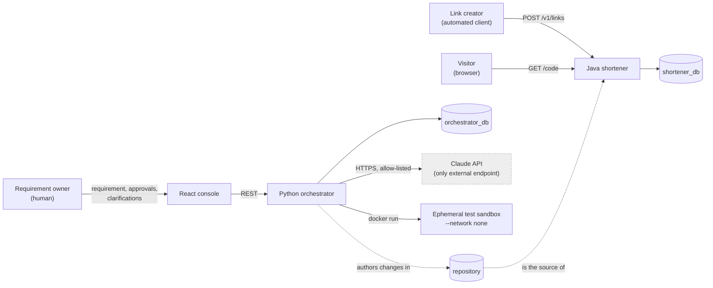
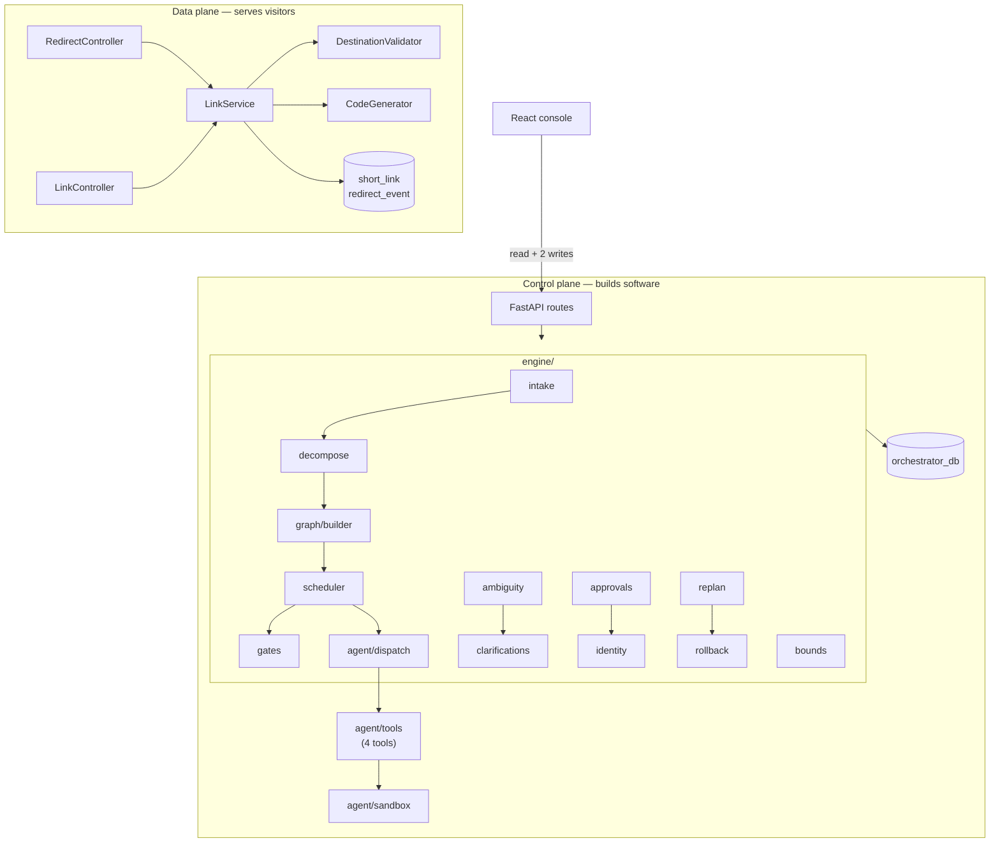
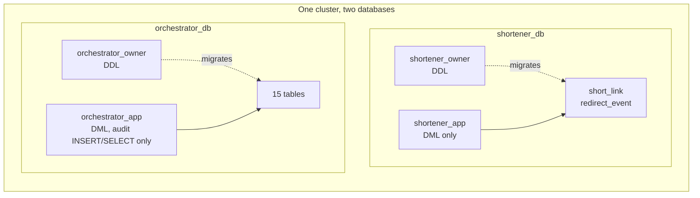
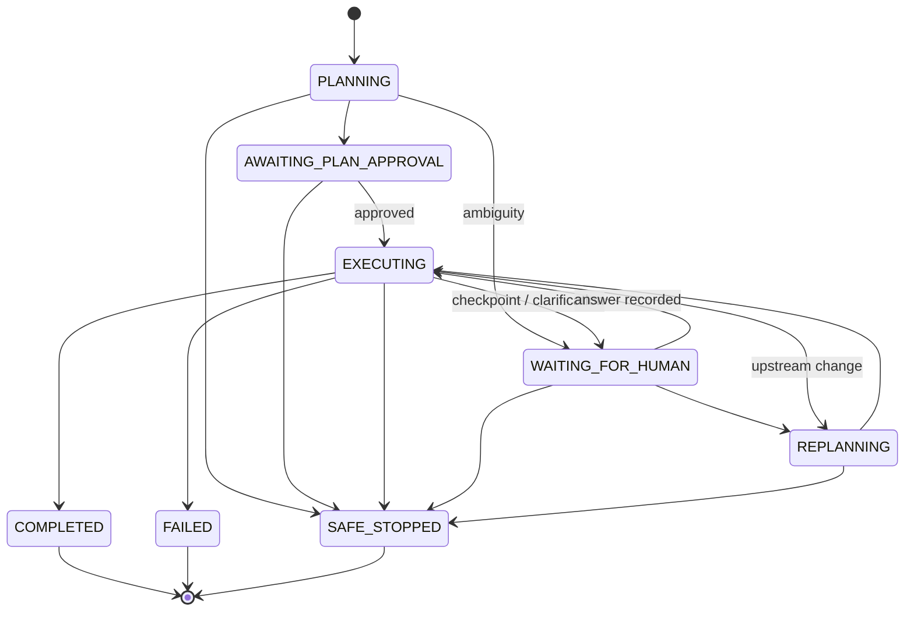
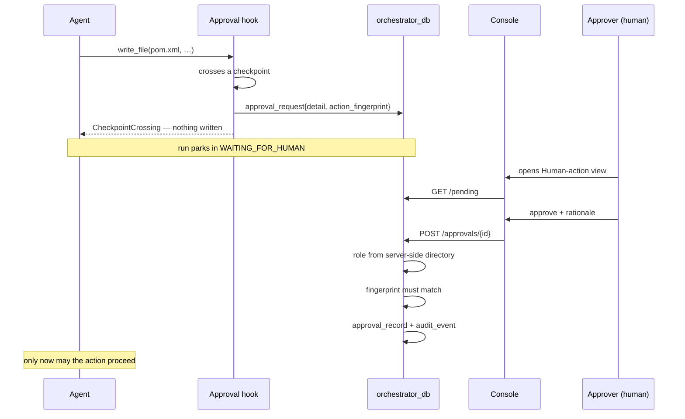
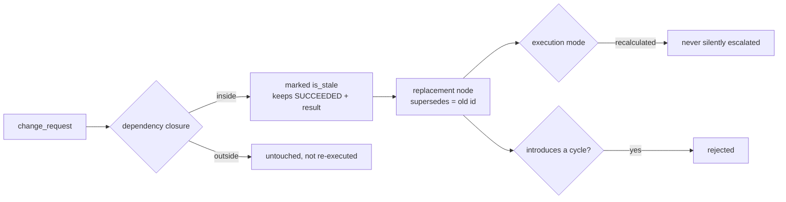

# High-Level Design

**Feature:** `specs/001-agentic-url-shortener` · **Status:** implemented, Gate II approved 2026-08-18
· **Source of truth:** the code in this repository, not this document

This describes what is built. Approved deferrals are marked **DEFERRED_APPROVED** wherever they
appear; nothing here describes a capability that does not exist.

---

## 1. Problem statement

Two problems, deliberately coupled.

The **stated** problem is a production URL shortener: turn a long destination into a short code,
resolve it fast, count it exactly, and never become an open redirect.

The **real** problem is the one the shortener exists to serve as a workload: can an agentic
software-delivery system take a natural-language requirement through interpretation, planning,
implementation, test and review — with enough control that a bank would let it near a codebase?
That question is only answerable against real work, so the shortener is the work.

A URL shortener is a good choice precisely because it is small enough to be delivered end to end,
yet has genuine engineering content: uniqueness under concurrency, exact counting under load,
scheme validation, and an availability boundary between the redirect path and everything else.

## 2. Goals and non-goals

**Goals**

- Deliver the shortener to production quality — validated input, exact analytics, measured latency.
- Orchestrate delivery through an explicit DAG with persisted state, gates, and human checkpoints.
- Make autonomy *bounded and auditable*: every agent action traceable to a requirement, every
  material decision recorded with its rationale and its actor.
- Fail closed. Any missing boundary stops the run rather than degrading it.

**Non-goals**

- A shortener frontend (FR-017). Creators call the API; visitors only follow a redirect.
- Server-side fetching of destinations (FR-018) — the prohibition, not an omission.
- Multi-tenant scale, HA, or geo-distribution. Single-region, single-instance assumptions.
- Replacing human judgment. Architecture, security, destructive and release decisions stay human.
- General-purpose agent capability. The model sees four tools and no more.

## 3. System context



The orchestrator **never calls the shortener**. It builds it. The only runtime coupling between
the two halves is the repository and the humans.

## 4. Component view



### 4.1 Java shortener — the workload

Java 21, Spring Boot 3.3.5, Spring MVC, Spring Data JPA, Flyway, springdoc-openapi.

`RedirectController` resolves a code; `LinkController` creates, revokes and reports analytics.
`LinkService` holds the transaction boundary. `DestinationValidator` enforces the scheme
allow-list and length cap **syntactically** — there is no reachability check, by requirement.
`CodeGenerator` produces 7 characters from a 62-symbol alphabet with a bounded collision retry.

**One connection pool: `redirect-pool` (16).** The `application.yaml` block naming an
`analytics-pool` is not bound by any `@Configuration` — Spring creates a single `DataSource`, and
a real startup log shows `redirect-pool` only. See §18 for the correction record.

What protects the redirect path today is the *query shape*, not pool partitioning:
`LinkService.summary()` is a `@Transactional(readOnly = true)` primary-key lookup that reads
counters denormalised onto `short_link` and never scans `redirect_event`. There is no heavy
analytics query to starve anything, and T098 measured peak concurrency at 2 of 16 connections.

Pool separation becomes justified when **FR-014 event-history analytics** lands — that is the
first query shape that scans events — and it is deferred until then (`tasks.md § Deferred
Capabilities`).

### 4.2 Python orchestrator — the control plane

Python 3.13, FastAPI, SQLAlchemy **Core** (not the ORM) over psycopg.

`engine/` is the orchestration: intake and interpretation, decomposition into `TaskNode`s, graph
construction with cycle rejection, a scheduler honouring dependencies and sync nodes, entry/exit
gates, ambiguity detection, clarifications, approvals, bounded execution, selective replanning,
rollback. `agent/` is the bounded runtime: four tools, a per-task path allow-list, an approval
hook, an ephemeral Docker sandbox, and a process egress guard.

SQLAlchemy Core rather than the ORM because the orchestrator's writes are append-only records
with explicit correlation columns. An identity map and lazy loading would add a caching layer
between the code and an audit trail whose entire value is being exactly what was written.

### 4.3 React console — the human surface

React 18 + TypeScript + Vite. **Exactly two views**: a Run view and a Human-action view.

The console is a *view over recorded state, never the sole location of it* (FR-048). It holds no
module-level store and no cache; every value is re-fetched on mount, so a reload cannot show a
state the server does not hold. That is enforced by test, not convention.

**DEFERRED_APPROVED:** separate gates / replan / metrics / audit screens. Their content is
API-visible and surfaced within the Run view.

### 4.4 PostgreSQL ownership boundaries



Four roles, and no credential spans both databases. `orchestrator_app` holds **INSERT and SELECT
on `audit_event` and nothing else** — no UPDATE, no DELETE, no TRUNCATE. Audit immutability is
therefore a database privilege, not a code convention; the repository class exposing no mutation
method is the *second* layer, not the only one. Provisioned by `ops/db/provision.sh`, a HUMAN task.

## 5. Control plane vs data plane

The separation is the architecture's load-bearing decision, and it comes from **NFR-002**: the
redirect path stays available when analytics and orchestration degrade.

| | Data plane | Control plane |
|---|---|---|
| Serves | Visitors and API clients | The requirement owner |
| Latency budget | p95 < 150 ms, p99 < 400 ms | None — humans wait |
| Availability | The thing being protected | May be stopped at any time |
| Failure mode | Must keep redirecting | Safe-stop and wait |
| Process | Java, port 8080 | Python, port 8000 |
| Database | `shortener_db` | `orchestrator_db` |

The acceptance test is literal: **stop the orchestrator; redirects keep working.** A single
process could assert that independence but could not demonstrate it, which is why there are two
services and two databases rather than one process with two modules.

## 6. Orchestration: DAG, gates, lifecycle



`SAFE_STOPPED` is reachable from **every** non-terminal state. That is Principle VII taken
literally: a run that cannot stop safely because of where it happens to be is the exact failure
the principle prohibits. This was a correction — the original model omitted the
`WAITING_FOR_HUMAN → SAFE_STOPPED` edge, and an exhausted clarification budget had nowhere to go.

A plan is a DAG. Cycles are rejected **before execution begins**, not discovered during it. A
node becomes ready only when every predecessor is `SUCCEEDED` — not merely terminal, which was a
second correction: treating `SKIPPED` as sufficient let downstream work run after a skipped sync
node. Sync nodes release only when every inbound branch has terminated, and record each branch's
outcome, including the mixed case where one sibling failed while another succeeded.

Every stage declares an **entry gate** and an **exit gate**. Every evaluation is recorded — pass
or fail — because "the gate passed" and "the gate was never evaluated" must not look alike.

## 7. Controlled autonomy

An agent may implement a **bounded task**: one whose interface, acceptance criteria, dependencies
and security constraints are *already approved*. Everything else halts.

The model sees exactly four tools:

| Tool | Bound |
|---|---|
| `read_file` | One file inside the task's surface, subject to a deny overlay |
| `write_file` | Only a path in this task's frozen `declared_outputs` |
| `run_tests` | An **enum layer** — never a command, path, host, or container option |
| `report` | Ends the turn |

There is no fifth tool. The FR-041 prohibitions hold structurally: an agent cannot introduce a
datastore with no tool that installs or configures one, and cannot release with no tool that
builds or deploys. `web_search`, `web_fetch`, `code_execution` and MCP connectors are **never
declared** — declaring any would turn the one permitted egress into a general-purpose proxy.

Bounding the *tool surface* does not bound code the agent *wrote*. That is the sandbox's job (§9).

## 8. Human approval model



Four properties, each tested:

1. **Halt before apply.** The mutation has not happened when the human is asked. A rejection
   leaves the artifact byte-identical.
2. **Approval authorises one action**, identified by a SHA-256 `action_fingerprint` of the request
   detail. It is not a standing permission and does not transfer.
3. **Roles come from a server-side directory**, never from the request. `X-Actor-Id` is identity;
   a client asserting `approver` is ignored.
4. **No agent identity can hold the approver role.** Any `agent:` prefix is refused and audited —
   enforced in code, not policy.

Checkpoints: architecture, security, destructive, release, governance, scope.

## 9. Sandbox and security boundary

```mermaid
graph TB
    subgraph HOST["Host — orchestrator process"]
        ORCH[dispatch] -->|docker run| CTR
        ORCH -->|allow-list guard| NET{egress}
        NET -->|permitted| ANTH[api.anthropic.com]
        NET -->|permitted| PG[(orchestrator_db)]
        NET -->|EgressDenied| WORLD[everything else]
    end
    subgraph CTR["Ephemeral container (per invocation)"]
        COPY[disposable copy of ONE surface]
        LIM["--network none · non-root · cap-drop ALL<br/>no-new-privileges · pids/mem/cpu caps<br/>tmpfs /tmp · no Docker socket"]
    end
    CTR -.discarded on every path.-> X[/dev/null]
```

**The authoritative repository is never mounted** — not writable, not read-only. Each invocation
copies one approved surface into a disposable directory, runs there, and discards it. Excluded
from the copy: `.git`, `ops`, `.specify`, `specs`, `.env*`, `.ssh`, `.aws`, key material.

`run_tests` **fails closed**: no Docker daemon or no image raises `SandboxUnavailable`, safe-stops
the task, preserves state, and audits the reason. It never falls back to host execution — without
the sandbox there is no boundary, and running anyway would be the one unrecoverable mistake.
Images are built by a provisioning step (`ops/sandbox/build-images.sh`); the runtime can only
*check* for an image, verified by an AST test asserting no `docker build`/`pull` exists in it.

Integration tests get a database without getting the internet: the orchestrator starts a
disposable PostgreSQL on an `--internal` Docker network. The test runner never receives the
Docker socket, so it cannot start or reach anything the orchestrator did not place there.

The orchestrator process additionally installs an egress allow-list (Claude endpoint, its own
database, loopback). This is **defense in depth for this process only** — see §17 for its limit.

## 10. Audit and decision lineage

Five record types, all append-only:

| Table | Answers |
|---|---|
| `audit_event` | What happened, in order — every action, gate, approval, retry, failure, rollback, transition |
| `decision_record` | What was decided, the alternatives, the rationale, the actor |
| `change_record` | What changed, with prior state and hashes |
| `rollback_event` | What was reverted, and whether it worked |
| `trace_link` | requirement ↔ task ↔ change ↔ test, both directions |

Every record carries `run_id`, `trace_id` and `span_id`. Audit payloads are refused if they carry
a secret — checked on **both** key names and value shapes (URL userinfo, API-key patterns, auth
headers, inline credential assignments). It fails loudly rather than redacting quietly.

Bidirectional traceability is a live capability, not a document: `untraceable_changes(run_id)`
reports any change with no originating requirement, which is what an FR-035 audit consumes.

## 11. Selective replanning



**Staleness is a flag, not an erasure.** A stale node keeps `SUCCEEDED` and keeps its result; the
replacement links back with `supersedes`. That is what makes "what did we previously conclude, and
why are we redoing it" answerable afterwards. A full restart is not the fallback — it is the
failure the requirement exists to prevent.

The brownfield decision ladder (research R13) runs cheapest-rung-first: verify query/index/pool
→ narrow the transaction → batch or materialise the counter → **only then** a cache tier. A rung
that adds a component halts for architecture approval and implements nothing.

## 12. Resilience: bounds, safe-stop, rollback

Every automated operation declares `timeout_seconds`, `max_attempts`, `backoff_seconds` and a
`fallback` **before it runs**. `OperationPolicy` is frozen and **never handed to the operation** —
the callable receives an attempt number and nothing else, so there is no reference through which
it could raise its own budget. Backoff is capped rather than doubling forever. Attempts are
persisted *per attempt*, so a process that dies mid-retry resumes with the budget it actually
spent, not a fresh one.

On exhaustion the declared fallback runs: `SAFE_STOP`, `WAIT_FOR_HUMAN`, or a named handler
registered before dispatch. A fallback that was not declared cannot be invented after failure.

Rollback restores prior state byte-identically and refuses to clobber a later edit. A **failed**
rollback is the dangerous case — the artifact is in neither the old nor the intended state — so it
safe-stops and is audited rather than being retried.

## 13. Observability and metrics

Per run and across runs: success rate, retry frequency, rollback frequency, MTTR, end-to-end
latency, human wait.

Two conventions that matter more than they look:

- **`null` means unknown; `0` means measured zero.** A run with no failures has `mttr = null`, not
  `0`. The console renders them differently — an em dash versus a number — because a reviewer must
  not read "nothing failed" as "recovery was instant".
- **Human wait is excluded from MTTR and end-to-end latency** and reported separately. A run that
  waited three days for an approver did not take three days to recover.

Nothing is counted in memory; metrics survive a reload because they are computed from the store.

## 14. Performance baseline

Measured 2026-08-20, `perf/baseline-2026-08-20.md`. 100,000 links, 100 redirects/sec, 120 s,
open-loop, redirects not followed, synchronous analytics **not** bypassed.

| | Nominal | Hot skew (70% → 5 links) | Budget |
|---|---|---|---|
| Throughput | 100.0 rps | 100.0 rps | 100 rps |
| p95 | **6.82 ms** | **6.62 ms** | < 150 ms |
| p99 | **10.84 ms** | **11.64 ms** | < 400 ms |
| Errors | 0 | 0 | — |

~22× headroom on p95, ~34× on p99. Database time was ~0.24 ms of a ~5.4 ms request; active
connections peaked at 2 of 16. Hot-row counter contention is real and quantified — the counter
`UPDATE` mean moved 0.072 → 0.088 ms — and immaterial at this operating point. Exact accounting
held under load: 26,801 events == 26,801 counted redirects.

One finding worth carrying: the `redirect_event` **insert**, not the counter update, is the
largest database contributor. If optimisation is ever needed, that is where the evidence points.

## 15. Major trade-offs

| Decision | Why | What was given up |
|---|---|---|
| Two services, two databases | NFR-002 demands demonstrable redirect independence | Deployment and operational complexity; no cross-service transaction |
| Polyglot Java + Python | Java is the assessed production workload; the agent tooling is most direct in Python | A single toolchain; two test harnesses |
| Synchronous analytics in the redirect transaction | SC-006 requires *exact* counts; a queue makes counting eventual | A redirect fails if it cannot be counted — accepted, and returns `redirect_not_recorded` (503) |
| Simple indexed table, no partitioning | Measured p95 6.8 ms at 100k links | A migration later if scale demands it |
| SQLAlchemy Core, not ORM | The audit trail must be exactly what was written | ORM convenience |
| Four tools, no shell | Prohibitions hold structurally rather than by policy | Agent flexibility |
| Docker required for `run_tests` only | Bounds agent-authored code | A dependency, scoped by a Gate II addendum |

## 16. Why Redis was not introduced

This is the clearest instance of Constitution Principle XI, so it is recorded rather than assumed.

Redis is the reflexive answer for a URL shortener: cache the code→destination mapping. It was
**deliberately excluded from the greenfield architecture** by the approved plan, and research R13
defines the only path back in — a *measured* budget breach, attributed to datastore access, with
every cheaper rung exhausted first.

T098 measured it. p95 is 6.82 ms against a 150 ms budget. **R13's first condition is not met, so
the ladder does not begin.** Adding Redis would have bought ~6 ms of a 150 ms allowance while
adding a cache-invalidation problem on revoke and expiry, a second datastore to provision and
secure, and a new failure mode on the path NFR-002 exists to protect.

The mechanism is also enforced, not just documented: the replan ladder places `CACHE_TIER` in
`NEW_COMPONENT_OPTIONS`, so proposing it halts for human architecture approval and implements
nothing. Tests assert the default choice is the cheapest rung and that Redis is reachable only
when every cheaper rung is exhausted.

## 17. Deployment assumptions

- Single region, single instance per service. No HA, no failover, no geo-distribution.
- One PostgreSQL 16 cluster, two databases, four roles, provisioned by a human before first run.
- The shortener serves `http://host:8080`; codes resolve at the service root, so the reserved-path
  set (`/v1`, `/actuator`, health) can never be issued as a code.
- The orchestrator needs outbound HTTPS to the configured Claude endpoint and nothing else.
- Docker is required **only** for `run_tests`; every other orchestration function runs without a
  daemon. Scoped by a HUMAN-approved Gate II addendum.
- Sandbox images are built by provisioning, never by the runtime.
- Console builds to static assets; in development a Vite proxy forwards `/v1` and `/health`.
- No TLS termination, secret manager, or identity provider is included. `X-Actor-Id` and
  `X-Client-Id` stand in for authenticated sessions; the *authorisation* decision does not depend
  on that substitution, but authentication itself is deployment work.

## 18. Known limitations

- **Correction (production-hardening, 2026-08-21): there is one connection pool, not two.**
  Earlier revisions of this document, `README.md` and the traceability matrix stated that a
  `redirect-pool` and an `analytics-pool` isolated analytics load from the redirect path. The
  `analytics-pool` was never implemented — `application.yaml` declares it, but no
  `@Configuration`, `@Bean` or `@ConfigurationProperties` binds it, and a real startup log shows
  `redirect-pool` only. Found by implementation verification during a production-readiness
  review, not by a failing test. The claim was corrected in all three documents rather than the
  pool being added, because the analytics summary is a bounded primary-key lookup with no query
  shape to isolate (§4.1). **No human approval record was altered** — the NFR-002 approver ruling
  in `plan.md` concerns service and database independence, which remains implemented.
- **A raw `socket.connect()` bypasses the egress guard, by design.** The guard wraps `getaddrinfo`
  and `create_connection` — the entry points every stdlib and third-party HTTP client uses — and
  cannot wrap the syscall those wrappers call. It is defense in depth for orchestrator code; the
  boundary for agent-authored code is `--network none`. Asserted by a test so it stays recorded.
- **The perf baseline is single-host.** Client, server and database share one machine.
- **One usability observation** (T022). SC-001 asks whether the flow is learnable without training,
  which one unaided success answers; it supports no claim about typical time.
- **The orchestrator `unit` test layer is effectively empty** — one test, misfiled. Logic is covered
  at the workflow and failure layers. Reported in the traceability audit, not yet closed.
- **Ten tasks cite research decisions rather than requirement ids**, contrary to the project's own
  `(REQ)` rule. Bookkeeping, not out-of-scope work.
- **DEFERRED_APPROVED:** custom aliases (FR-005), creation rate limiting (FR-015), paginated event
  history (FR-014 history half), event retention sweep (FR-013 retention half), separate console
  screens (FR-045/FR-047), and two US4 test scenarios. Each is designed with contract and data
  model specified; none is built. Registered in `tasks.md § Deferred Capabilities`.
- **`X-Client-Id` is unauthenticated.** Ownership checks are enforced, but a caller may claim any
  client id. Real authentication is deployment work.
