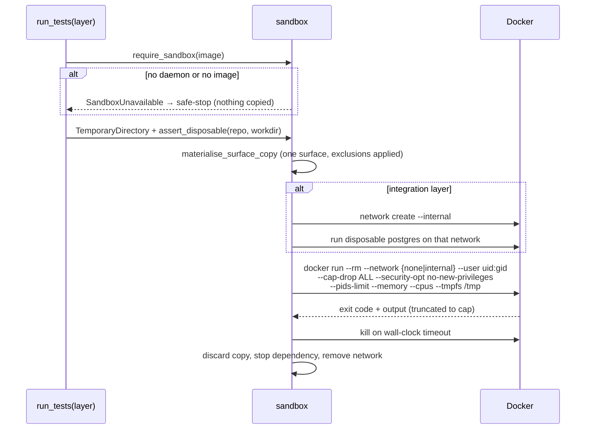
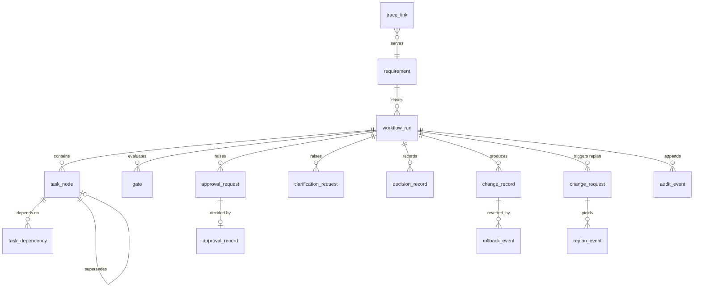
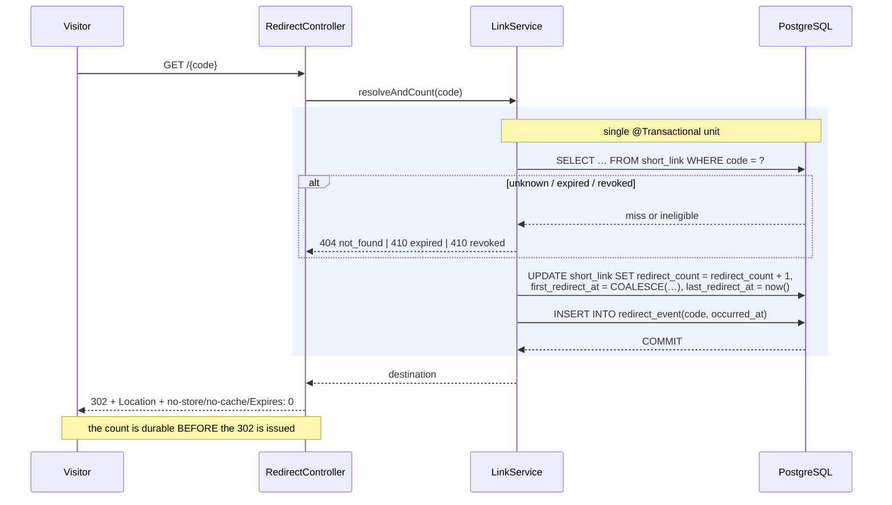

# Low-Level Design

Companion to [HLD.md](HLD.md). This is the implementation-level reference: module layout, the
types that carry the invariants, the algorithms, and the public interfaces with the rationale
NFR-008 requires.

Everything here is read from the code. Approved deferrals are marked **DEFERRED_APPROVED**.

---

## 1. Module and package layout

### 1.1 Orchestrator — `orchestrator/src/`

```
api/        app.py            FastAPI app; installs the egress guard at import time
            routes.py         /v1 read endpoints + trace
            approvals_api.py  the two write endpoints
            deps.py           engine + server-side actor/role directory
            errors.py         ErrorCode, OrchestratorError
engine/     intake.py         Requirement, interpretation
            decompose.py      TaskNode, SURFACE_ROOTS, planning-time freeze
            scheduler.py      readiness, concurrency, sync release
            gates.py          entry/exit evaluation, always recorded
            ambiguity.py      detection + question generation
            clarifications.py request/answer lifecycle
            approvals.py      Checkpoint, fingerprint, ApprovalService
            identity.py       Actor, APPROVER_ROLE
            guardrails.py     scope + governance-artifact protection
            bounds.py         OperationPolicy, BoundedExecutor
            replan.py         closure, staleness, decision ladder
            rollback.py       RollbackStore, failed-rollback safe-stop
            decisions.py      DecisionStore (lineage)
            state.py          StateStore, validated transitions
graph/      builder.py        TaskGraph, cycle rejection, descendants
            sync.py           SyncPolicy, BranchOutcome
agent/      tools.py          the four tools + schemas
            client.py         request assembly; forbidden tools never declared
            allowlist.py      PathPolicy — per-task read/write resolution
            changes.py        prior-state capture, atomic write, revert
            dispatch.py       bounded task loop, tier A/B/C handling
            approval_hook.py  halt-before-apply
            sandbox.py        container lifecycle, isolated network
            testrunner.py     fixed argv table per (surface, layer)
            config.py         EgressPolicy, socket guard
            errors.py         failure taxonomy
audit/      metrics.py        FR-037 metric set
            trace.py          TraceStore, bidirectional traceability
store/      repository.py     AuditRepository (append-only), secret rejection
            migrations/       001–006
trace/      correlation.py    Correlation(run_id, trace_id, span_id, actor)
models/     states.py         every state enum and the transition tables
```

### 1.2 Shortener — `shortener/src/main/java/com/schwab/shortener/`

```
web/          LinkController, RedirectController
web/errors/   ErrorCode, ApiError, ApiException, ApiExceptionHandler, UnauthenticatedException
service/      LinkService                      — the transaction boundary
domain/       ShortLink, RedirectEvent, CodeGenerator
persistence/  ShortLinkRepository, RedirectEventRepository
validation/   DestinationValidator, ReservedPaths
trace/        Correlation
resources/db/migration/  V1__baseline.sql, V2__short_links.sql
```

### 1.3 Console — `console/src/`

```
api/client.ts          typed transport; ApiClientError; array validation
App.tsx                two tabs; empty state when no run is selected
views/RunView.tsx      graph, gates, lineage, audit, metrics
views/HumanActionView.tsx  approvals + clarifications
components/Dag.tsx     dependency graph rendering
```

## 2. The workflow state machine

Enums and transition tables live in `models/states.py`; `StateStore.transition_run` validates
every move against `ALLOWED_RUN_TRANSITIONS` and persists it. An invalid transition raises
`InvalidTransition` — it is not silently coerced.

**Run:** `PLANNING`, `AWAITING_PLAN_APPROVAL`, `EXECUTING`, `WAITING_FOR_HUMAN`, `REPLANNING`,
`COMPLETED`, `FAILED`, `SAFE_STOPPED`, `ABANDONED`. The last four are terminal.

**Node:** `PENDING → READY → RUNNING → {SUCCEEDED | FAILED}`; `FAILED → READY` is the bounded
retry edge; `SUCCEEDED → ROLLED_BACK`; `PENDING`/`READY → SKIPPED` for unreachable nodes.

Two invariants worth stating because both were corrections:

- `SAFE_STOPPED` is reachable from **every** non-terminal state, including `WAITING_FOR_HUMAN`.
- Readiness requires every predecessor `SUCCEEDED` — **not merely terminal**. `SKIPPED` is
  terminal but is not success, and treating it as sufficient let downstream work run after a
  skipped sync node.

**Staleness is not a state.** It is an orthogonal boolean, so a stale-but-succeeded node keeps the
result replanning may still consult.

## 3. `TaskNode`: fields and immutability

```python
@dataclass(slots=True)
class TaskNode:
    id, description, requirement_ref: str
    execution_mode: ExecutionMode
    surface: Surface
    depends_on: list[str]
    declared_inputs:  tuple[str, ...]
    declared_outputs: tuple[str, ...]
    is_sync: bool
    supersedes: str | None
    state: NodeState
    is_stale: bool
    attempt_count: int
    timeout_seconds, max_attempts, backoff_seconds: int
    result: dict | None
```

`FROZEN_AFTER_PLANNING` = `{id, requirement_ref, execution_mode, surface, declared_inputs,
declared_outputs, is_sync, supersedes}`. `__setattr__` raises `MODE_ESCALATION` if any is assigned
after the node is frozen. Mutable execution fields — `state`, `attempt_count`, `is_stale`,
`result` — are deliberately outside the set.

`__post_init__` enforces: a non-blank `requirement_ref` (FR-035 — a task with no requirement is
out of scope), `max_attempts >= 1`, and normalisation of both declared sequences to **tuples**, so
they cannot be appended to in place. Widening a declared set requires replanning, not assignment.

### 3.1 `declared_inputs` / `declared_outputs`

Populated at planning time. `declared_outputs` **is** the agent's write allow-list — not the
surface, not the repository. FR-041 permits agent authorship only where the interface is already
approved, and an output set the agent could widen mid-run would not be an approved interface.

Validation at construction: paths explicit and safe, inside the task's own surface root, no
duplicates. An `AGENT_AUTHORED` task with no outputs is refused; a `HUMAN_EXECUTED` task may
declare none; a sync node must declare none.

### 3.2 Execution modes

`AGENT_AUTHORED` and `HUMAN_EXECUTED`, declared at planning time. `is_escalation()` makes the rule
explicit: `HUMAN_EXECUTED → AGENT_AUTHORED` is escalation and is forbidden. A human-executed node
is never dispatched to an agent, and replanning recalculates mode without silently escalating it.

## 4. `OperationPolicy` and bounded execution

```python
@dataclass(frozen=True, slots=True)
class OperationPolicy:
    timeout_seconds: float
    max_attempts: int
    backoff_seconds: float
    fallback: FallbackAction          # SAFE_STOP | WAIT_FOR_HUMAN | HANDLER
    fallback_handler: str | None      # required when fallback is HANDLER
    max_backoff_seconds: float = 30.0
```

Two design choices carry the guarantee:

- The policy is frozen and **never handed to the operation**. The callable receives an attempt
  number and nothing else — there is no reference through which it could raise its own budget.
- Attempts are persisted **per attempt**, not at the end, so a process that dies mid-retry resumes
  with the budget it actually spent.

Timeout is enforced **per attempt** via a worker with `shutdown(wait=False)` — waiting on the
executor would join the runaway task and defeat the timeout it exists to impose. Backoff is
capped. `UndeclaredFallback` prevents inventing a fallback after failure.

**Scope.** This bounds *operations*. It deliberately does not replace the dispatcher's violation
budget and wall-clock ceiling, the sandbox's container limit, the code generator's collision cap,
or the clarification round cap — those bound different things.

## 5. Approval flow and `action_fingerprint`

```python
def fingerprint(detail: dict) -> str:
    return sha256(json.dumps(detail, sort_keys=True, separators=(",", ":")).encode()).hexdigest()
```

Canonical JSON so the same action always fingerprints identically and a different action never
collides.

1. The approval hook detects a checkpoint-crossing tool call **before apply** and raises
   `CheckpointCrossing`. Nothing is written.
2. An `approval_request` row is inserted with `detail`, `action_fingerprint`, `requested_by`,
   state `pending`. The run transitions to `WAITING_FOR_HUMAN`.
3. A human decides via the console. `resolve_actor` takes identity from `X-Actor-Id` and **roles
   from the server-side directory**; any `agent:` id is refused the approver role outright.
4. A rationale is mandatory. The decision writes `approval_record` + `audit_event`; the request
   moves to `decided`. Deciding twice raises `AlreadyDecided`.
5. The approval authorises **only** the action whose fingerprint matches. A rejection authorises
   nothing and leaves the artifact unchanged.

Checkpoints: `architecture`, `security`, `destructive`, `release`, `governance`, `scope`.

## 6. Clarification lifecycle

`PENDING → ANSWERED`. The ordering rule the module exists to enforce: **the answer is persisted
before the run leaves `WAITING_FOR_HUMAN`.** Resuming on a client's say-so, or on an in-memory
answer, would let a lost write resume a run that was never actually clarified.

An empty answer raises `AnswerRequired`; answering twice raises `AlreadyAnswered`. Answers carry
actor, timestamp, the requirement they affect, and land in decision lineage. Rounds are bounded —
an insufficient answer raises one further clarification, and exhaustion ends in safe-stop, not an
open loop. Resume without an answer leaves the run exactly where it was.

## 7. `audit_event` and trace linkage

```
audit_event(id, run_id, event_type, actor, trace_id, span_id, payload JSONB, occurred_at)
```

`AuditRepository` exposes `append`, `for_run`, `count` — **no update, no delete**, asserted
structurally by `audit_repository_is_append_only()` and independently by database privilege.

`Correlation(run_id, trace_id, span_id, actor)`: a child keeps the trace and starts a new span.
The same field names are used in the Java service, so a trace id means one thing across both.

`_reject_secrets` checks **keys** (`password`, `api_key`, `token`, …) and **values** (URL userinfo,
`sk-` key shapes, auth headers, inline credential assignments). It raises rather than redacting —
a payload carrying a secret is a bug to fix, not text to launder — and the error names the pattern,
never the matched text.

`trace_link(requirement_ref, task_ref, change_ref, test_ref)` supports `for_requirement()`,
`requirement_for_change()`, and `untraceable_changes(run_id)`.

## 8. `ChangeRecord` and the rollback algorithm

```python
@dataclass(frozen=True, slots=True)
class ChangeRecord:
    task_id, surface, artifact_path, execution_mode: str
    existed: bool
    prior_state: str | None      # inline up to 256 KiB
    prior_sha256: str | None
    new_sha256: str
    applied_at: str
    approving_human: str | None
```

**Write:** capture prior bytes and hash *before* a byte is modified → write to a temp file in the
same directory → `os.replace` (atomic) → return the record. A crash mid-write still leaves a
restorable record. Writes over 1 MiB are refused; prior state too large to capture refuses the
write rather than losing reversibility — an irreversible change is worse than a refused one.

**Revert:** re-hash the file on disk. If it differs from `new_sha256`, someone edited it since —
**refuse**, rather than clobbering a later edit. Otherwise restore prior bytes, or delete if the
file did not previously exist. Deletion exists in exactly one place and no tool can reach it.

`RollbackStore.record` writes a `rollback_event` linked to the change. A **failed** rollback
safe-stops and is audited — the artifact is in neither the old nor the intended state, and
retrying blind is how that becomes permanent.

## 9. Selective replan algorithm

1. Persist a `change_request` linked to the prior run.
2. Compute the **dependency closure** of the named nodes via `graph.descendants()`.
3. Inside the closure: mark `is_stale = True`, **keep** `SUCCEEDED` and **keep** the result.
   Outside: untouched, not re-executed.
4. Create replacement nodes with `supersedes` pointing at what they replace, so prior results stay
   queryable.
5. Recalculate execution mode; never silently escalate.
6. Rebuild and re-validate — a replan that would introduce a cycle is rejected.
7. Record a `replan_event` and a `decision_record` with the trigger and blast radius.

Repeated replanning does not duplicate unaffected work. `OptimisationOption` is the R13 ladder:
`VERIFY_QUERY_PATH → NARROW_TRANSACTION → BATCH_COUNTER → CACHE_TIER`. `NEW_COMPONENT_OPTIONS`
contains `CACHE_TIER`, so selecting it halts for architecture approval and implements nothing.
Absent measurements, the ladder starts at the bottom rung.

## 10. Sandbox lifecycle



`TEST_COMMANDS` maps `(Surface, TestLayer)` to an **argv tuple**, never a string — there is no
shell in this path, so `;`, `&&` and `$( )` have no meaning anywhere in it. The agent supplies only
the enum. `assert_disposable` refuses to run against the authoritative tree as a checked invariant.

## 11. Egress controls

`EgressPolicy(allowed_hosts)` permits the configured Claude host, the database host derived from
`ORCHESTRATOR_DB_URL`, and loopback. `install_socket_guard` wraps `socket.getaddrinfo` and
`socket.create_connection`; anything else raises `EgressDenied` (`forbidden`). Installed at import
time in `api/app.py`, before any router or connection pool exists.

Configuration URLs are redacted before appearing in any message — `_redacted()` strips userinfo,
so a DSN or an authenticating base URL cannot leak a password on the failure path.

**Scope: this guard is defense in depth, not the containment boundary.** It covers *this process
only* — an accidental or injected outbound call from orchestrator code, a dependency phoning home,
a misconfigured base URL. **Docker/container network isolation is the security boundary for
untrusted agent-authored execution**: code the agent wrote runs with `--network none`, and the
integration layer runs on an `--internal` network. A guard in the parent process does nothing for a
child process, and describing it as the sandbox would overstate what it does.

**Limitation, asserted by test:** a raw `socket.socket().connect()` bypasses the guard. It wraps
the entry points every HTTP client uses and cannot wrap the syscall those wrappers call. Full
evidence in `docs/security/egress-verification.md`; accepted as risk **J2** under the T102 review
(`docs/security/security-review.md` §7.2), on the basis that container networking is the primary
untrusted-code boundary.

## 12. Database tables and relationships

**`shortener_db`**

```
short_link(code PK varchar(32), destination, destination_canonical, client_id,
           created_at, expires_at, revoked_at, redirect_count, first_redirect_at, last_redirect_at)
  indexes: PK(code), (client_id), (expires_at) WHERE NOT NULL
  check:   destination not blank
redirect_event(id PK bigserial, code FK→short_link.code, occurred_at)
  indexes: (code, id) stable-ordered reads; (occurred_at) retention sweep [DEFERRED_APPROVED]
```

Counters live on `short_link` rather than being derived from `redirect_event`, so lifetime counts
survive event retention. No partitioning — removed from the plan as ceremony at this scale.

**`orchestrator_db`** — 15 tables across migrations 001–006:



`sync_node` is not a table: it is a `task_node` with `is_sync = true`.
`rate_limit_window` is designed and **DEFERRED_APPROVED** — deliberately absent.

## 13. REST endpoint inventory

**Shortener** — `docs/contracts/shortener-openapi.json`, CI-gated for parity.

| Method | Path | Purpose |
|---|---|---|
| `POST` | `/v1/links` | Create. `{destination, expires_at?}` → 201 `{code, destination, created_at, expires_at}` |
| `GET` | `/{code}` | Resolve → **302** + `Location`, `Cache-Control: no-store, no-cache, must-revalidate`, `Pragma: no-cache`, `Expires: 0` |
| `POST` | `/v1/links/{code}/revoke` | Owner-scoped revoke |
| `GET` | `/v1/links/{code}/analytics` | Owner-scoped summary `{code, total_redirects, first_redirect_at, last_redirect_at}` |

**Orchestrator** — `docs/contracts/orchestrator-openapi.json`, CI-gated.

| Method | Path | Purpose |
|---|---|---|
| `GET` | `/v1/runs` | List runs |
| `GET` | `/v1/runs/{id}` | Detail + FR-037 metrics + replans |
| `GET` | `/v1/runs/{id}/graph` | Nodes and edges with per-node state and staleness |
| `GET` | `/v1/runs/{id}/gates` | Every gate evaluation, pass or fail |
| `GET` | `/v1/runs/{id}/audit` | The audit trail |
| `GET` | `/v1/runs/{id}/decisions` | Decision lineage |
| `GET` | `/v1/runs/{id}/pending` | `{approvals[], clarifications[]}` |
| `POST` | `/v1/runs/{id}/approvals/{request_id}` | Decide. `{decision, rationale}` + `X-Actor-Id` |
| `POST` | `/v1/runs/{id}/clarifications/{request_id}` | Answer. `{answer}` + `X-Actor-Id` |
| `GET` | `/v1/trace` | Bidirectional traceability query |
| `GET` | `/health` | Liveness |

Nine reads, two writes. The asymmetry is the design: the console observes, and a human may do
exactly two things — decide an approval and answer a clarification.

## 14. Redirect transaction sequence



The commit precedes the response. If the count cannot be durably recorded, the redirect is **not
served** — `DataAccessException` maps to 503 `redirect_not_recorded`. SC-006 asks for exact counts,
and serving an uncounted redirect would trade the requirement for availability silently.

The redirect target is always the stored destination. A destination supplied at resolution time —
a query parameter, say — is ignored, which is what keeps this from being an open redirect.

## 15. Error model

Both services return `{"error": "<stable_id>", "message": "<prose>"}`. The identifier is the
contract; the prose is for humans. Additive-only within a major version.

**Shortener:** `invalid_scheme`, `malformed_url`, `url_too_long`, `not_found`, `expired`,
`revoked`, `forbidden`, `redirect_not_recorded`; **DEFERRED_APPROVED but declared:**
`alias_conflict`, `alias_reserved`, `alias_malformed`, `rate_limited` — declared so clients can
branch on them once the capability lands, and proven unreachable through the API by test.

Scheme is checked **before** URI parsing: `data:text/html,<script>` is not syntactically a URI, and
reporting it as `malformed_url` would hide that the scheme was the problem — and the scheme
allow-list is the security control.

Missing `X-Client-Id` is **401** (`UnauthenticatedException`), not 403: absent identity and
insufficient permission are different conditions.

**Orchestrator:** `not_found`, `invalid_request`, `cycle_detected`, `unknown_dependency`,
`missing_requirement_ref`, `invalid_transition`, `gate_failed`, `mode_escalation`,
`audit_immutable`, `forbidden`.

**Agent failure taxonomy** — three deliberately distinct tiers:

| Tier | Exception | Meaning |
|---|---|---|
| A | `PreconditionFailed` | Never dispatched; no model call. Requires replanning |
| B | `ToolViolation` | One tool call refused and returned to the agent. Recoverable, counted |
| C | `CheckpointCrossing` | Halt **before** apply; wait for a human. Nothing written |
| — | `SafeStop` | Escalation: halt, preserve state, notify. Never a retry |
| — | `SandboxUnavailable` | Boundary failure, not degradation. Never falls back to the host |

## 16. Test-layer mapping

| Layer | Marker / selector | What it covers |
|---|---|---|
| Unit | `-m unit` / `**/unit/*Test` | Pure logic: validation, code generation, correlation, error identifiers |
| Workflow | `-m "workflow and not integration"` | Interpretation, decomposition, graph validity, scheduling, gates, ambiguity, replan |
| Integration | `-m integration` | Real PostgreSQL via Testcontainers: store shape, metrics, console API, approvals |
| Failure | `-m failure` | Capability boundary, sandbox escape, egress, fail-closed, rollback, approval integrity, bounds |
| Contract | `-m contract` / `**/contract/*Test` | OpenAPI parity both services; traceability matrix consistency |
| Console | `vitest` | API parity, boundary validation, two-view behaviour, empty state |

Counts at time of writing: orchestrator 316 (failure 157), shortener 27 unit + 44 contract +
integration/failure via `verify`, console 49.

**Known gap:** the orchestrator `unit` layer collects one test, and that test is an endpoint test
filed under `tests/integration/`. Its logic is covered at the workflow and failure layers; the
missing thing is the layer Principle IV names separately. Reported, not closed.

---

## 17. Public interfaces — rationale (NFR-008)

NFR-008 requires documented rationale for public interfaces. For each: why it exists, who calls
it, why the boundary is shaped this way, and why material alternatives were rejected.

### 17.1 Shortener REST API

**Why it exists.** FR-016: every operation except the redirect must be available to automated
clients through a versioned contract with machine-readable shapes and stable error identifiers.

**Who calls it.** Automated link creators (`POST`, `revoke`, `analytics`, all owner-scoped by
`X-Client-Id`) and browsers (`GET /{code}` only, which must work with no client-side scripting).

**Why shaped this way.** Codes resolve at the **service root**, not under a prefix, because a
short link's whole value is being short. That forces a reserved-path set so `/v1` and `/actuator`
can never be issued as codes. Creation is `/v1`-versioned; the redirect deliberately is not,
because the redirect contract is HTTP itself.

**Rejected alternatives.** A frontend (FR-017) — creators are programmatic, and shipping a UI would
add a surface with no requirement. `301` instead of `302` — a permanent redirect is cached by the
browser, so revoke and expiry would silently stop working and analytics would undercount; the
non-cacheable header set exists for the same reason. Returning the destination as JSON for the
client to follow — that is not a redirect and breaks the browser case.

### 17.2 Orchestrator REST API

**Why it exists.** FR-045 through FR-048: a human needs to see run state, gates, lineage and audit,
and to act on approvals and clarifications — and everything the console shows must be retrievable
programmatically so the console is never the only place a fact lives.

**Who calls it.** The React console, and any reviewer with curl.

**Why shaped this way.** Nine reads, two writes. A human may do exactly two things: decide an
approval and answer a clarification. There is deliberately **no endpoint to resume a run** — the
run resumes because an answer was persisted, not because a client asked. That closes the hole
where a lost write plus a resume call restarts a run that was never clarified.

**Rejected alternatives.** WebSocket or SSE streaming — real-time updates would tempt the console
into holding authoritative state, which FR-048 forbids; polling on mount keeps the server the only
source of truth. A generic `PATCH /runs/{id}` — a general mutation endpoint cannot express "this
approval authorises exactly this fingerprinted action".

### 17.3 The model-visible tool set

**Why it exists.** It *is* the capability boundary. FR-041 permits an agent to implement a bounded
task; the tool set is what makes "bounded" mechanical rather than aspirational.

**Who calls it.** Only the Claude model, through `dispatch`, for `AGENT_AUTHORED` tasks whose four
approvals are all present.

**Why shaped this way.** Four tools, and the shape of each is the control. `write_file` accepts
only a path already in the task's frozen `declared_outputs`. `run_tests` takes an **enum**, never a
command — so there is no argument through which a shell could be reached. `read_file` is bounded by
surface plus a deny overlay covering `ops/`, `.git/`, `.specify/`, key material and `.env*`.

**Rejected alternatives.** A shell tool — one tool that ends every prohibition, since installing a
datastore and deploying a release both become one command. A git tool — history rewriting is a
governance action. A package-install tool — dependency changes are exactly the checkpoint FR-041
protects; instead, writing a manifest raises `CheckpointCrossing`. `web_search`/`web_fetch`/
`code_execution`/MCP — all would make the model provider a general-purpose proxy and turn the one
permitted egress into a bypass of the whole boundary.

### 17.4 Database and service boundaries

**Why it exists.** NFR-002 (redirect independence) and NFR-006 (least privilege).

**Who calls it.** Each service reaches only its own database, with an application role that has no
DDL. Migrations run as a separate owner role.

**Why shaped this way.** Two databases and four roles because one database with two schemas
re-couples the services at exactly the layer NFR-002 asks to decouple, and a credential spanning
both weakens the privilege boundary. `orchestrator_app` holding **INSERT and SELECT only** on
`audit_event` makes immutability a privilege rather than a promise — code review cannot be the last
line of defense for an audit trail.

**Rejected alternatives.** A shared database — cheaper to run, but the NFR-002 acceptance test
("stop the orchestrator, redirects still work") becomes unprovable. A message broker between the
services — they have no runtime coupling to broker. A single role per database — convenient, and it
would let application code drop the audit table.

### 17.5 The approval interface

**Why it exists.** FR-029, FR-043 and FR-050: high-impact decisions require recorded human
approval, obtained *before* the change is applied, from an identity no agent can assume.

**Who calls it.** The approval hook raises requests; humans decide them through the console.

**Why shaped this way.** An approval is bound to an `action_fingerprint` — a hash of the exact
request detail — so it authorises one action rather than granting standing permission. A rationale
is mandatory: an approval with no reason is unreviewable afterwards, which defeats the record.
Roles come from a server-side directory so a client cannot assert its own authority.

**Rejected alternatives.** Role in the request header — then "the API enforces the approver role"
means only "the client says it holds it". Approve-by-checkpoint-type rather than by action — a
blanket "architecture approved" would cover changes the approver never saw. Optimistic apply with
rollback on rejection — the artifact would briefly hold unapproved content, and FR-043 says halt
*before* apply for exactly that reason.

### 17.6 The console ↔ API boundary

**Why it exists.** FR-048: the console must be a view over recorded state, never the sole location
of it.

**Who calls it.** The browser, through `console/src/api/client.ts` — the single transport module.

**Why shaped this way.** The client is a transport with **no store and no cache**, asserted by a
test that fails if a module-level store is exported. Every value is re-fetched on mount, so a
reload cannot display something the server does not hold. It validates shapes at the boundary:
array-returning endpoints must return arrays, and a response that is not valid JSON raises
`ApiClientError` naming path, status and content type — never the body, which could carry anything.

**Rejected alternatives.** A client-side store (Redux, Zustand) — it would become a second source
of truth for run state, which is precisely what FR-048 prohibits. Normalising a malformed response
to `[]` — that was the original defect: a routing outage rendered as "no gates" and looked like a
healthy idle system. Failing loudly turns an invisible outage into an obvious one.
